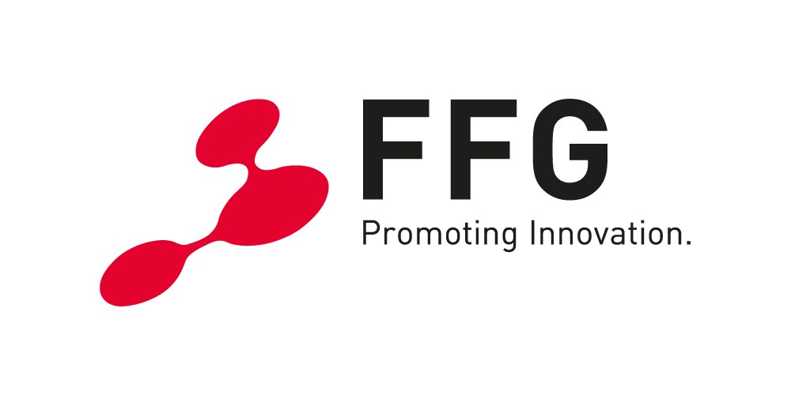

# Home_BESS

Home_BESS is a project for the simulation and control of a home battery energy storage system (BESS).
Try it out online: [homebattery.labs.fhv.at](https://homebattery.labs.fhv.at/)

## Project Structure
- `src/` – Source code for control, simulation, interfaces, and forecasting
- `tests/` – Test scripts and test data

## Installation
1. Install Python 3.11+
2. Create and activate a virtual environment:
   ```bash
   python -m venv .venv
   source .venv/bin/activate
   ```
3. Install the package:
   ```bash
   pip install -e .
   ```

## Usage
The main functions are located in the `src/` directory. For more information on usage and development, see [README_maintainer.md](README_maintainer.md).

## Acknowledgments
<a href="https://projekte.ffg.at/projekt/4597880">
  
</a>

We gratefully acknowledge the financial support from the Austrian Research Promotion Agency FFG for the Hub4FlECs project (COIN FFG 898053), which provided funding for the development of the software provided. https://projekte.ffg.at/projekt/4597880

<br clear="left">

## License
See [LICENSE](LICENSE).
