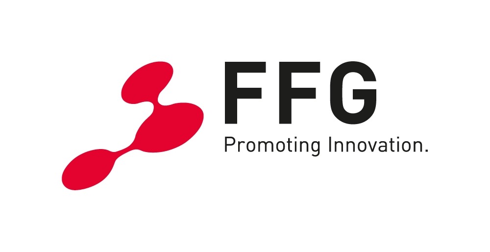

# Overview

This repository contains two complementary projects:

1. **Web-based simulation tool** – An easy-to-use simulation for evaluating whether investing in a home battery energy storage system (BESS) is economically beneficial for a household with photovoltaic (PV) generation. Try the online dashboard at **https://homebattery.labs.fhv.at/**.

2. **Real-world Model Predictive Control (MPC)** – An MPC framework for residential battery energy storage systems that optimizes battery operation using mixed-integer linear programming (MILP). The controller leverages real-time electricity prices and weather-based net load forecasting to minimize operating costs.

# Related Paper and Citation

A detailed description of the real-world MPC implementation and an extensive evaluation can be found in our paper (currently available on arXiv):

> https://arxiv.org/abs/XXXX

If you use this repository in your research, please cite:

```bibtex
@article{moosbrugger2026real,
  title={Real-World Model Predictive Control for Home Battery Systems: Towards Closing the Simulation-to-Reality Gap},
  author={Moosbrugger, Lukas and Seiler, Valentin and Wohlgenannt, Philipp and Ristov, Sashko and Kepplinger, Peter},
  journal={arXiv preprint},
  year={2026},
  doi={10.48550/arXiv.XXX}
}
````

## Acknowledgments

<a href="https://projekte.ffg.at/projekt/4597880">
  
</a>

This work was financially supported by the Austrian Research Promotion Agency (FFG) through the **Hub4FlECs** project (COIN FFG 898053). We gratefully acknowledge the FFG for funding the development of the software presented in this repository.

Project page: https://projekte.ffg.at/projekt/4597880

<br clear="left">

## License

This project is licensed under the terms of the [LICENSE](LICENSE) file.
